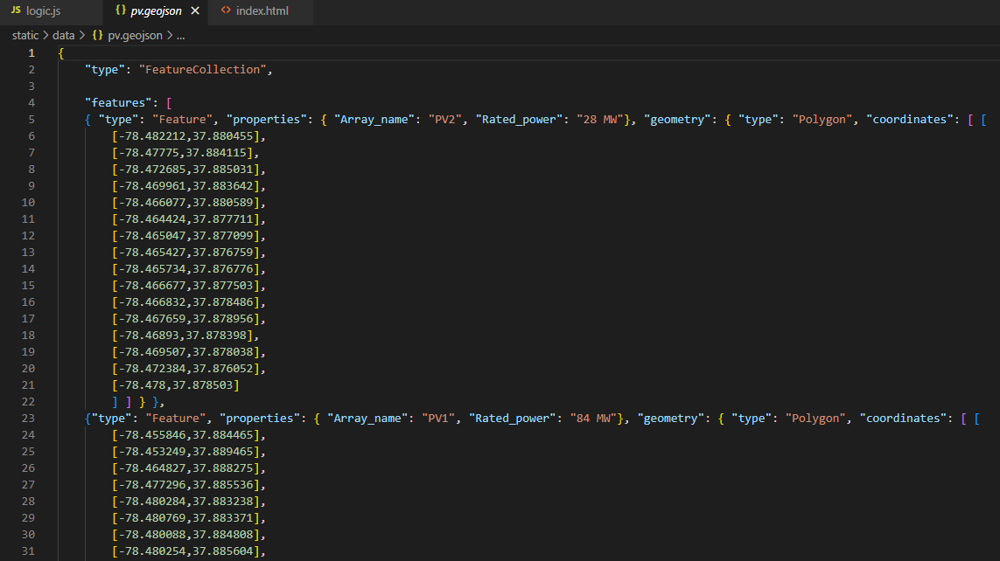
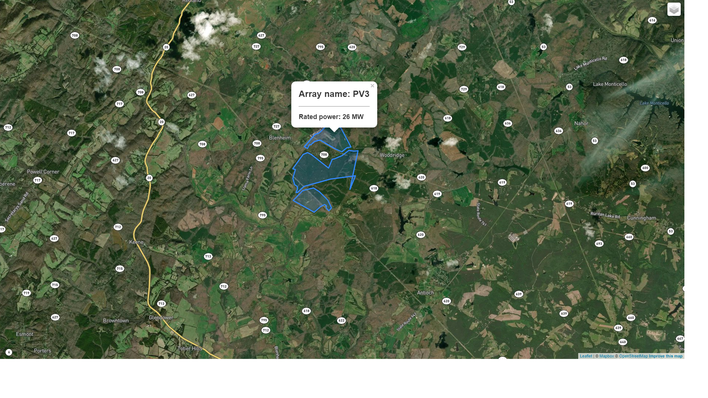

# Woodridge Solar PV array boundaries map

This project maps the approximate boundaries of where Charlottesville-based Hexagon Energy proposes to place PV panels as part of its Woodridge Solar project, for which 
it is seeking a special use permit from Albemarle County, Virginia.

If approved, the Woodridge Solar facility would occupy approximately 1,500 acres in the southeast part of the county, with solar panels spread out in clusters over
that area (nearly 650 acres of solar panel total). 

For more on the proposed solar facility, see the [FAQ](https://myneighborsgroup.files.wordpress.com/2022/11/woodbridge-solar-faq-by-livable-cville.pdf) published 
by Livable Cville on November 15, 2022.

## PV panel boundaries
Hexagon Energy's May 16, 2022, [special use permit application](https://lfweb.albemarle.org/WebLink/DocView.aspx?id=1490382&dbid=0&repo=CountyofAlbemarle&cr=1) provides
geographical coordinates representing the boundaries of where the company proposes to place PV panels. The panels will not fill the entire areas outlined in my map, as
they will occupy smaller sections within those boundaries. Hexagon used these coordinates to conduct a glare analysis for its proposal.

## Making the map
The SUP application is a PDF file. I copied the coordinates data tables from the PDF into Excel and cleaned it there. I then used [this tool]
(https://www.convertcsv.com/csv-to-geojson.htm) from convertcsv.com to create a GeoJSON file with the coordinates data for each of the three proposed PV arrays. 

I created the map using Mapbox and Leaflet. The map allows users to click on each of the three solar array polygon outlines. The pop-up box shows the number of the array
and its rated power. Users can also choose whether to show the satellite-and-streets map layer or the OpenStreetMap layer.

## To do
Array PV1 has an odd shape on its southeastern corner, as rendered by my map. The triangle that appears there may be due to an issue in the underlying coordinates data;
it may be due to an issue that arose when I cleaned the data; or it may be an accurate representation of the PV array boundaries. Before publishing this map anywhere, I 
would need to investigate this question. 
